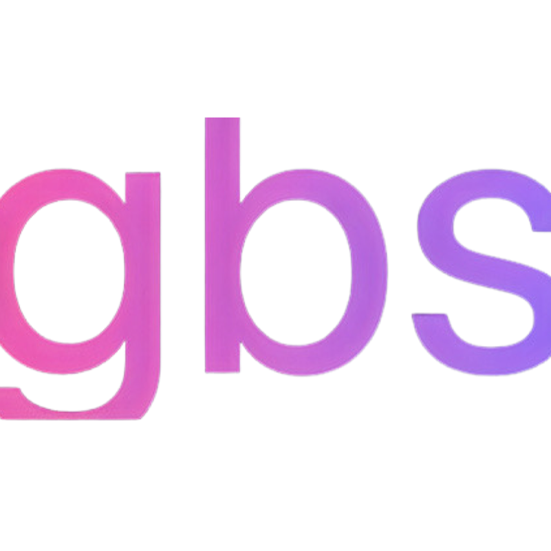

# ✨ Neon YouTube Animation Intro ✨

<div align="center">
  
  

### [@gbsonstage](https://www.youtube.com/@gbsonstage)

  <p>🎮 Eye-catching, neon-effect intro animation for your YouTube channel 🎮</p>
  
  [🇬🇧 English](#-neon-youtube-animation-intro-) | [🇹🇷 Türkçe](#-neon-youtube-animasyon-İntrosu-)

**👉 Please consider subscribing to the [channel](https://www.youtube.com/@gbsonstage) and leaving a like! 👈**

</div>

## 🌟 Animation Features

- 💜 Bright neon color effects
- 🎬 Customizable video sections
- ✨ Flying emoji animations
- 🔄 3D rotating logo animation
- 💫 Live particle effects
- 🔔 "Like & Subscribe" calls to action

## 🚀 Technologies

- 🌐 [Next.js](https://nextjs.org/)
- ⚡ [Framer Motion](https://www.framer.com/motion/)
- 🎨 [TailwindCSS](https://tailwindcss.com/)

## 📱 Responsive Design

Designed to work on all screen sizes! Looks great on mobile devices, tablets, and desktop screens.

## 🎥 How to Use

1. Clone the project
2. Install dependencies: `yarn install`
3. Start the development server: `yarn dev`
4. Replace the video files with your own content
5. Customize your channel name and colors

## 💖 Let's Get Started!

Give your channel a professional look immediately with this animation intro!

```bash
# Clone the project
git clone https://github.com/gorkem1/youtube-animation.git
cd youtube-animation

# Install dependencies
yarn install

# Start the development server
yarn dev
```

<div align="center">
  
  ### 🎮 Happy Streaming! 🎮
  
</div>

---

# ✨ Neon YouTube Animasyon İntrosu ✨

<div align="center">
  
  

### [@gbsonstage](https://www.youtube.com/@gbsonstage)

  <p>🎮 YouTube kanalınız için göz alıcı, neon efektli intro animasyonu 🎮</p>
  
  **👉 Lütfen [kanalı](https://www.youtube.com/@gbsonstage) ziyaret edip, abone olmayı ve beğenmeyi unutmayın! 👈**

</div>

## 🌟 Animasyon Özellikleri

- 💜 Parlak neon renkli efektler
- 🎬 Özelleştirilebilir video bölümleri
- ✨ Uçuşan emoji animasyonları
- 🔄 3B dönen logo animasyonu
- 💫 Canlı parçacık efektleri
- 🔔 "Beğen & Abone Ol" çağrıları

## 🚀 Teknolojiler

- 🌐 [Next.js](https://nextjs.org/)
- ⚡ [Framer Motion](https://www.framer.com/motion/)
- 🎨 [TailwindCSS](https://tailwindcss.com/)

## 📱 Responsive Tasarım

Tüm ekran boyutlarına uygun olarak tasarlanmıştır! Mobil cihazlarda, tabletlerde ve masaüstü ekranlarda harika görünür.

## 🎥 Nasıl Kullanılır

1. Projeyi klonlayın
2. Bağımlılıkları yükleyin: `yarn install`
3. Geliştirme sunucusunu başlatın: `yarn dev`
4. Video dosyalarını kendi içeriklerinizle değiştirin
5. Kanal adınızı ve renklerinizi özelleştirin

## 💖 Hadi Başlayalım!

Bu animasyon intro ile kanalınıza hemen profesyonel bir görünüm kazandırın!

```bash
# Projeyi yükleyin
git clone https://github.com/gorkem1/youtube-animation.git
cd youtube-animation

# Bağımlılıkları yükleyin
yarn install

# Geliştirme sunucusunu başlatın
yarn dev
```

<div align="center">
  
  ### 🎮 İyi Yayınlar! 🎮
  
</div>

---

## 📝 License / Lisans

MIT
